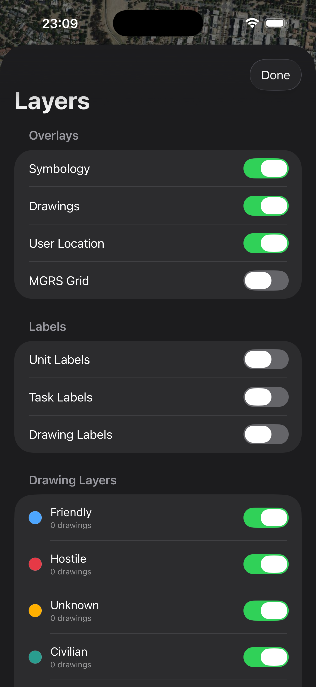
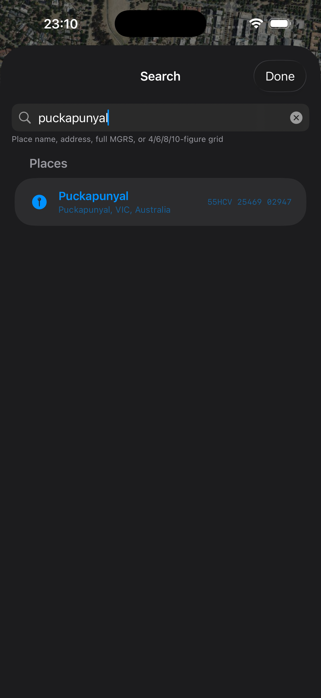

# TacMap

[](LICENSE)
[](#)
[](#)
[](#)
[](https://github.com/JediBrooker/TacMap/actions/workflows/ios.yml)
[](https://github.com/JediBrooker/TacMap/actions/workflows/android.yml)

Offline-first field navigation with live MGRS, APP-6 symbology,
GeoPDF/calibrated-PDF basemaps, drawing overlays round-tripped as GeoJSON, and
fiduciary calibration for any PDF that lacks proper georeferencing. iOS (SwiftUI
+ custom raster renderer) and Android (Kotlin + Compose + custom raster renderer)
ship from one repository.

> The app's **display name is TacMap**. The Xcode project, Gradle modules,
> bundle id (`com.tacticalmaps.app`) and Android application id (`com.tacmap`) keep the
> original **TacticalMaps** name for continuity, so the build commands below
> still reference `TacticalMaps`.

<p align="center">
  
  &nbsp;
  
  &nbsp;
  
</p>

<details>
<summary>More screenshots</summary>

<p align="center">
  
  &nbsp;
  
  &nbsp;
  
</p>

<p align="center">
  
  &nbsp;
  
</p>

</details>

The middle screenshot is the **USGS San Francisco North** 1:24,000 US Topo
quadrangle (public domain) rendered live over the satellite. Run
`scripts/fetch_samples.sh` to drop the same PDF into `samples/` for testing.

---

## What it does today

### Live navigation HUD

- **Live MGRS** in a tactical-green monospace at the top, spaced as
  `56HLH 13225 37516`. Header flips between **Your Location** (GPS fix) and
  **Map Centre** (when you pan away) automatically.
- **WGS84 lat/lon** at the crosshair, plus **elevation** (metres above sea
  level) from Open-Meteo's Copernicus DEM (≈30 m global resolution). Online
  lookups are off on a fresh install, can be enabled independently, and the
  request is debounced while panning.
- **North-reference compass** in degrees or NATO mils (6400 per circle), clearly
  labelled for true, magnetic, or grid north. The N marker stays clear of the
  readout while pointing to the selected reference. In **North Up**, one tap
  first resets a rotated map and a second tap enables **Heading Up**; tapping
  again returns to North Up.
- **Centre-pivot rotation** — the custom renderers spin the map in place around
  the screen centre on both platforms. Heading Up instead follows the phone's
  compass automatically as you turn.

### Symbology, drawing & waypoints

- **APP-6(C) military symbols** — compose a unit symbol from affiliation
  (Friend / Hostile / Neutral / Unknown), echelon (Team → Division) and
  function (Infantry, Armour, Artillery, Engineer, Recce, …), with an HQ flag.
  Frame shape, fill colour and echelon marks follow the standard.
- **Tactical task graphics** — the point-symbol mission-task / control-measure
  set (Block, Breach, Ambush, Attack-by-Fire, Axis of Advance, Screen, Seize,
  Form-Up Point, Landing Zone, …). Each supports **rotation**, independent
  **width / height** scaling, and a **colour** — Black (default), Blue
  (Friendly), Red (Hostile), Green (Neutral) or Yellow (Unknown).
- **Generic markers** with a name, notes and elevation.
- **Custom symbol packs** (2.0.2+) — import a TacMap JSON pack of PNG artwork,
  search pack/category/symbol names offline, and place previews on your own
  layers. Search ignores case and accents and supports multiple words. Packs
  persist in encrypted storage; placed markers retain their original colours
  and proportions and carry their artwork through GeoJSON and Unit Sync, so
  compatible recipients do not need the whole pack. See the
  [import guide](docs/SYMBOL_PACK_GUIDE.md),
  [German guide](docs/de/SYMBOL_PACK_GUIDE.md), and
  [pack format and converter](docs/CUSTOM_SYMBOL_PACKS.md). A ready-to-import
  [German emergency services pack](site/public/downloads/German-Emergency-Services.symbols.json)
  contains 894 symbols.
- **Draw polylines, polygons, points and free-hand** — tap successive points
  or drag to sketch, undo the last vertex, finish to commit. In-progress
  shapes render dashed; finished shapes carry an editable stroke colour,
  width and dash style.
- **Layers & labels** — drawings and symbols share one layer model, so toggling
  a layer hides both at once. Per-feature labels are off by default and toggled
  from **☰ → Layers and Labels**.
- **Undo / redo** for every placement, edit and delete — the system
  `UndoManager` on iOS (shake-to-undo + ⌘Z) and a snapshot stack on Android,
  both surfaced as on-map buttons.
- **Import & export GeoJSON** following the [Mapbox simplestyle-spec]
  (stroke / stroke-width / fill / fill-opacity / marker-color / marker-symbol
  with [Maki icon] names). Round-trips through **geojson.io, GitHub gists,
  Mapbox, Felt, Leaflet, QGIS, ArcGIS, Google Earth**.

[Mapbox simplestyle-spec]: https://github.com/mapbox/simplestyle-spec
[Maki icon]: https://github.com/mapbox/maki

### Measurement & route recording

- **Measure distance, bearing and area** — tap successive map points to see
  total distance, the latest segment's bearing in degrees or NATO mils, and
  enclosed area for three or more points. Undo vertices or close the tool;
  measurements are temporary and do not create saved drawings.
- **Background route recording** stores each accepted fix in an encrypted track
  log and exports the route separately as standard GPX. **Export All Mission
  Objects** creates GeoJSON for waypoints, symbols, drawings, and layers.

### GeoPDF basemap

- Import any **GeoPDF** through the system document picker. The private app copy
  replaces the online basemap and stays anchored to its true geographic bounds
  when you pan / zoom / rotate.
- **LGIDict parser** handles the OGC GeoPDF format used by ADF, AUSLIG, USGS,
  and most government topo PDFs:
  - Multi-entry LGIDicts (picks the one with `/Description (Layers)`)
  - PDF-string-encoded reals (e.g. `(135.83)` instead of `135.83`)
  - Projections: **LL** (geographic), **UT** (UTM), **TC** (Transverse
    Mercator routed through UTM when the central meridian matches a zone)
- **Adobe Geospatial fallback** for newer PDFs that use `/VP/Measure` +
  `/GPTS` instead of LGIDict.
- **Fiduciary calibration UI** for any PDF without proper metadata — tap
  3 known features on the PDF, enter their MGRS, and `AffineFitter` solves
  a least-squares affine to re-derive bounds. Shows RMS residual in metres
  to help you judge whether the fit is suitable for the task. Select WGS84,
  GDA94 or GDA2020 as the sheet datum; calibration shifts fiduciaries to WGS84.

### Offline raster basemap (MBTiles)

- Sideload a **`.mbtiles`** raster pyramid (e.g. `gdal_translate` +
`gdal2tiles.py` of any GeoPDF / raster) and the app serves it through a tile
overlay with **no network** — the real offline-field path. Import via
**☰ → Import Offline Tiles**; the bounds metadata frames the camera, and the
Layers sheet lets you unload it. iOS + Android.

### Search

- **Waypoints and drawings** by name, notes, type, or layer, ranked locally and
  deterministically.
- **Place name / address** is optional and uses Apple's place-search service on
  iOS or the device's platform geocoder on Android. Online lookups are off on
  a fresh install, can be enabled independently, and provider results
  follow local results.
- **Full MGRS** — type `56HLH 13225 37516`, jump straight there.
- **Partial grid** — type just **4 / 6 / 8 / 10 figures** (e.g. `1885`) and
  we resolve against your current GZD + 100km square prefix, then drop
  you at the centre of the implied square (1 km / 100 m / 10 m / 1 m
  precision respectively).
- Crash-safe: regex pre-validates MGRS shape before calling NGA's parser
  (which used to `fatalError` on partial input).
- Privacy-safe: coordinate-shaped input (including malformed or out-of-range
  text) is handled on-device and never forwarded to a place provider.

### Language & regional formatting

- **English, Deutsch or Device language** can be selected under
  **Settings, Privacy & OPSEC → Language** on both platforms. The saved choice
  updates app labels immediately without restarting the map or recording.
- App-owned controls, messages and measurement/date displays follow the selected
  language and regional formatting. User-created names, notes, pack labels,
  coordinates and shared data keep their original values. Device language falls
  back to English; no online translation service is used.
- Contributors can update the shared catalogue and generate both platforms'
  resources using the [localisation workflow](localization/README.md).

### Unit Sync & TacMap Chat

- **End-to-end encrypted Unit Sync** shares presence, symbols, drawings, and
  other mission objects between current iOS and Android devices in the same v3
  room. The relay routes ciphertext but still sees the metadata documented in
  the threat model.
- **TacMap Chat** sends encrypted text or reports either to the entire room or
  to one selected live unit, with a direct map shortcut and unread indicator.
  Chat v1 is live-only: **Routed** means relay-accepted, not delivered or read.
- **Stable presence** uses signed sessions, bounded reconnect backoff,
  implausible-GPS rejection, retained last-known markers, and explicit leave
  handling so transient relay loss does not make units teleport or vanish.
- **Optional screen-off presence** is separately off by default on both
  platforms and uses a visible system location indicator/foreground-service
  notification at the selected best-effort cadence.

---

## Repository layout

```
.
├── ios/                            SwiftUI app, XcodeGen-driven
│   ├── project.yml                 → .xcodeproj generation
│   ├── TacticalMaps/               app source
│   └── Vendor/mgrs-ios/            vendored fork with a 4-line Snyder UTM patch
├── android/                        Kotlin + Compose, Gradle
├── sync/                           encrypted Unit Sync / Chat relay and tests
├── localization/                   shared English/German catalogue and generators
├── site/                           bilingual website, downloads and site tests
├── docs/                           architecture, security, user and release guides
│   ├── CUSTOM_SYMBOL_PACKS.md      symbol-pack format and conversion instructions
│   ├── SYMBOL_PACK_GUIDE.md        user-facing import guide (German in de/)
│   ├── THREAT_MODEL.md             security boundaries and accepted limitations
│   └── screenshots/               README hero images
├── scripts/                        localisation, symbol-pack and store-asset tools
├── testdata/                       shared cross-platform golden vectors
└── samples/                        development sample instructions and downloads
```

---

## iOS — build & run

```bash
# 1. Tools (one-off)
brew install xcodegen
sudo xcode-select -s /Applications/Xcode.app/Contents/Developer
xcodebuild -runFirstLaunch

# 2. Prepare local configuration and generate the Xcode project
./scripts/bootstrap_ios_secrets.sh
cd ios
xcodegen generate

# 3. Open
open TacticalMaps.xcodeproj
```

The MGRS Swift package is vendored locally. Pick an iPhone simulator running
**iOS 16.3 or later** and press ▶. The bootstrap script creates
`ios/Secrets.xcconfig` if missing and preserves an existing file. Its default
empty Esri key supports offline use; add `ESRI_API_KEY` there to enable Esri
styles when online basemaps are allowed.

For repeatable command-line installs, pin one existing standard iPhone once and
reuse it for every update:

```bash
cd ios
./scripts/install_simulator.sh --device <EXISTING_IPHONE_SIMULATOR_UDID>

# Every later build/install uses that same simulator.
./scripts/install_simulator.sh
```

The installer never creates, clones, erases, or deletes simulators, and it
installs over the existing app so local data is preserved. It also rejects
linker-only builds. Do not pass `CODE_SIGNING_ALLOWED=NO` when building the app
for Simulator: that produces an incompletely signed bundle and causes TacMap's
Keychain-backed entitlement, app-lock, and sync identity writes to fail.

**Generate the App Store icon** (if you tweak the design in
`scripts/generate_icon.swift`):

```bash
swift scripts/generate_icon.swift
```

---

## Android — build & run

```bash
# 1. Tools (one-off)
brew install --cask android-studio android-commandlinetools
open -a "Android Studio"   # Run the first-launch SDK wizard + create an AVD

# 2. Optional: configure an Esri key for the Esri raster styles
#    Add it to android/local.properties (gitignored):
#       ESRI_API_KEY=...
#    (Falls back to the ESRI_API_KEY Gradle property or environment variable.)

# 3. Open in Studio
open -a "Android Studio" android
```

No key is required for offline PDF/GeoPDF and MBTiles use. Online basemaps are
off on a fresh install and can be enabled in Privacy & OPSEC settings. An empty
Esri key disables the Esri styles; the OpenTopoMap style remains subject to its
provider availability.

---

## Testing

Native test suites run on both platforms and gate CI. After the iOS setup above:

```bash
# iOS — XCTest (affine fit, MGRS, GeoJSON geometry, MBTiles, map geometry, …)
export IOS_SIMULATOR_UDID='<existing-iPhone-simulator-UDID>'
(
  cd ios
  xcodegen generate
  xcodebuild test -scheme TacticalMaps \
    -destination "platform=iOS Simulator,id=$IOS_SIMULATOR_UDID"
)

# Android — JVM unit tests (no emulator needed)
./android/gradlew -p android testDebugUnitTest
```

Select the iOS UDID from `xcrun simctl list devices available` and keep reusing
that simulator. These commands do not create, clone, erase, or delete one.

Cross-platform invariants (the affine solve, MGRS formatting, GeoJSON geometry)
are pinned by shared golden vectors in [`testdata/`](testdata/) that **both**
suites load, so the Swift and Kotlin ports can't silently drift.

Additional checks from the repository root:

```bash
# Shared localisation generation, coverage and regression checks
python3 scripts/check_localizations.py
python3 -m unittest discover -s scripts -p 'test_localization*.py'

# Website generation and tests
npm ci
npm run test:site

# Sync relay protocol tests and type checking
(cd sync && npm ci && npm test && npm run typecheck)
```

See [localisation](localization/README.md) for translation and device checks,
[the relay README](sync/README.md) for backend development, and
[website deployment notes](site/DEPLOY.md) for site configuration.

---

## Architecture overview

The single most important architectural choice: **all overlays (waypoints,
drawings, fiduciaries) are stored in WGS84**. MGRS is presentation-only,
computed on the fly via NGA's `mgrs-ios`. This means swapping basemaps
(satellite ↔ GeoPDF ↔ calibrated PDF) never requires re-projecting overlays.

Full design + math in [`docs/ARCHITECTURE.md`](docs/ARCHITECTURE.md).

---

## Roadmap

- **Wave 2 projections** — Lambert Conformal Conic (French IGN, Canadian
  NRCan, US state plane), arbitrary-central-meridian TM (UK OSGB36, NZ NZTM),
  non-WGS84 datum shifts.
- **Saved basemap library** — calibration can be recovered for an imported map;
  a richer multi-map library and management UI remain planned.
- **iCloud sync** for waypoints + drawings.
- **Encrypted mission packages** for transferring mission objects and related
  assets as one authenticated bundle.

---

## App Store status

The iOS build is App-Store-ready in terms of assets:

- 1024×1024 icon, launch screen, acknowledgements view all in place
- Public privacy policy at <https://tacmap.app/privacy>, generated from
  [`docs/PRIVACY_POLICY.md`](docs/PRIVACY_POLICY.md)
- Step-by-step submission checklist at
  [`docs/APPSTORE_CHECKLIST.md`](docs/APPSTORE_CHECKLIST.md)

Store availability, agreements, declarations, and review state are controlled
in App Store Connect and Google Play Console rather than this repository. Use
the checklists before every submission; their unchecked items are deliberately
human-owned release gates.

---

## Privacy

No TacMap accounts, ads, behavioural analytics, advertising IDs, or
developer-operated telemetry. Both platforms use the same custom raster map
engine. Online tiles (Esri/OpenTopoMap), online lookups (Open-Meteo and the
platform place provider), and Unit Sync are separate opt-in paths; all are off
by default. Coordinate/grid search remains on-device. StoreKit or Play Billing
can still reconcile the one-time unlock at launch/foreground and handles normal
store metadata without mission or location payloads.

Mission objects, calibration metadata, and track logs are encrypted in
app-private storage. Imported PDF/MBTiles bytes remain in their original format
inside app-private, OS-protected storage. Unit Sync content is end-to-end
encrypted, but its relay can see routing/session/IP/timing/size metadata and
also handles the room-admission token plus clear envelope, actor/session,
acknowledgement, and control fields. It reports — rather than independently
proves — session liveness. See the full
[`privacy policy`](https://tacmap.app/privacy) and
[`threat model`](docs/THREAT_MODEL.md).

On iOS and Android, a separate default-off OPSEC control can continue v3
location presence with the screen locked at a best-effort one, five, fifteen,
thirty, or sixty-minute cadence. iOS uses the foreground-started Core Location
session and system indicator; Android uses a location foreground service and
ongoing notification without requesting `ACCESS_BACKGROUND_LOCATION`. Joining a
v3 room while either location control is off pauses for explicit consent;
**Enable & Join** turns on both controls, while Cancel does not join.
The system background-location indicator remains visible; foreground return
reconnects and verifies a fresh Sync snapshot. Android-originated screen-off
presence runs only inside TacMap's dedicated, user-visible location foreground
service; it stops when the room or either location-sharing control is disabled.

---

## License

MIT — see [LICENSE](LICENSE). Includes vendored NGA `mgrs-ios` (MIT) with a
small Snyder UTM patch for Xcode 26 compatibility. Android's additional bundled
notices, including Java-WebSocket and SLF4J, are in
`android/app/src/main/assets/THIRD_PARTY_NOTICES.txt`.
