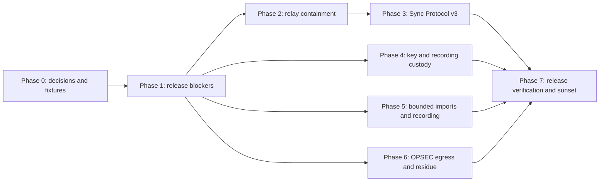

# TacMap security remediation plan

Status: **Proposed**

Audit baseline: `c270190ceaafa9e27f2e13fe9dc0266cab5eab69`

Scope: Android, iOS, the hosted/self-hosted sync relay, build pipeline, and security/privacy documentation.

This is the canonical plan for the findings from the July 2026 security review. It groups symptoms by architectural root cause, sequences changes that must roll out together, and gives each phase a testable exit condition. It is a plan only; its presence does not mean a finding is fixed.

## Outcomes

Work is complete only when all of these statements are true:

1. A room member cannot claim another device's identity, and invalid messages cannot create or change a trust record.
2. Android, iOS, and the relay use one canonical ordering rule and converge after concurrent edits, deletes, reconnects, and process death.
3. A hostile relay cannot roll back state already seen by a client or crash either client with malformed protocol values.
4. The public relay has enforceable per-message, per-room, and admission budgets that include tombstones and snapshot cost.
5. Auth-bound mission keys have an explicit lifetime, rotate without a single-key deletion window, and never silently regenerate over existing encrypted data.
6. Plaintext legacy migration is a one-time authenticated transition, not a permanent alternate input format.
7. Untrusted imports, exports, logs, caches, clipboards, storefronts, and background recording follow documented resource and OPSEC policies.
8. Every security invariant is represented in CI or in a named physical-device/staging release check.
9. `THREAT_MODEL.md`, privacy/store documentation, and implementation make the same claims.

## Execution order



Phases 4, 5, and 6 may run in parallel after Phase 1. Protocol v3 must not be activated until the relay, both clients, shared fixtures, and the migration UI are ready. Each workstream may use stacked PRs, but its plan item remains open until the activation/verification PR lands.

## Phase 0 - Ratify security contracts and test seams

### What to produce

1. Add three short architecture decisions under `docs/security/`:
   - `ADR-001-sync-protocol-v3.md`: identity derivation, signed preimage, version ordering, replay persistence, tombstone lifetime, v2/v3 migration, and join-code-holder trust boundary.
   - `ADR-002-key-lifetime-and-rotation.md`: foreground/background key lifetime, recording-session exception, two-slot recovery, missing-key behavior, and one-time plaintext migration.
   - `ADR-003-dark-egress-and-entitlement.md`: whether launch-time store checks are eliminated or retained and disclosed, including refund/revocation consequences.
2. Add `testdata/sync_protocol_v3.json` as the single source of truth for:
   - room/token derivation;
   - room-scoped actor and wire-object IDs;
   - canonical signed preimages and AAD;
   - valid/invalid canonical Base64URL;
   - `VersionStamp` comparison;
   - delete and presence replay cases.
3. Copy the fixture-loading convention from [testdata/README.md](../testdata/README.md), [Android SharedVectorsTest](../android/app/src/test/java/com/tacmap/SharedVectorsTest.kt), and [iOS SharedVectorsTests](../ios/TacticalMapsTests/SharedVectorsTests.swift). Add a relay consumer of the same fixture rather than creating relay-only expected values.
4. Collect production-like measurements before finalizing budgets:
   - ciphertext size percentiles and objects per room;
   - reconnect snapshot size and duration;
   - representative KML/KMZ/GeoJSON sizes and feature counts;
   - low-memory Android and iOS importer behavior.

### Provisional decisions to ratify

- The new wire protocol is named **v3**, lives under `/v3/room/`, uses v3 domain-separation labels, and never silently downgrades or shares a room with v2.
- A join-code holder remains authorized to create their own mutations. Protocol v3 prevents impersonation and replay; it does not introduce per-object roles or an owner/admin hierarchy.
- Tombstones remain for the lifetime of an active room. Reclamation happens through whole-room expiry/code rotation, not a seven-day per-record deletion.
- Anonymous public relay creation cannot be made abuse-proof using room-local source code alone. Phase 2 must bound it, and this phase must choose one residual-control policy: operator-issued anonymous admission voucher, proof-of-work plus platform rate controls, or an explicitly accepted cost ceiling.
- Auth-bound mode clears the master DEK on app lock/background. An explicitly active recording may retain only a narrower per-recording session key; the UI and threat model must disclose that exception.
- Initial importer limits for corpus testing are: 50 MiB source, 25 MiB actual inflated KML, 128 ZIP entries, 100:1 expansion ratio, 20,000 features, and 1,000,000 coordinates. Ratified values must be identical in product documentation and tests.

### Documentation and allowed APIs

- Sync crypto: [RFC 8032](https://www.rfc-editor.org/rfc/rfc8032.html), [RFC 4648](https://www.rfc-editor.org/rfc/rfc4648.html), and persistent replay-state guidance in [RFC 8613 section 12.4](https://www.rfc-editor.org/rfc/rfc8613.html#section-12.4).
- Cloudflare: [Durable Object storage](https://developers.cloudflare.com/durable-objects/api/legacy-kv-storage-api/), [alarms](https://developers.cloudflare.com/durable-objects/api/alarms/), [limits](https://developers.cloudflare.com/durable-objects/platform/limits/), [Rate Limiting binding](https://developers.cloudflare.com/workers/runtime-apis/bindings/rate-limit/), and [Workers Vitest integration](https://developers.cloudflare.com/workers/testing/vitest-integration/).
- Android: [Keystore authentication](https://developer.android.com/privacy-and-security/keystore), [BiometricPrompt](https://developer.android.com/identity/sign-in/biometric-auth), [foreground services](https://developer.android.com/develop/background-work/services/fgs/launch), and [secure clipboard handling](https://developer.android.com/privacy-and-security/risks/secure-clipboard-handling).
- Apple: [Keychain item access](https://developer.apple.com/documentation/security/adding-a-password-to-the-keychain), [`userPresence`](https://developer.apple.com/documentation/security/secaccesscontrolcreateflags/userpresence), [`NSFaceIDUsageDescription`](https://developer.apple.com/documentation/bundleresources/information-property-list/nsfaceidusagedescription), [`URLSessionConfiguration.ephemeral`](https://developer.apple.com/documentation/foundation/urlsessionconfiguration/ephemeral), and [`UIPasteboard.OptionsKey`](https://developer.apple.com/documentation/uikit/uipasteboard/optionskey).

### Verification

- All three ADRs are reviewed before protocol or key-format code changes.
- Android, iOS, and relay tests load the same v3 fixture file and initially fail for the missing implementation.
- Every provisional resource value is either ratified with measurements or replaced with a documented value.

### Anti-pattern guards

- Do not invent a protocol while implementing one platform.
- Do not edit expected vectors independently in three test suites.
- Do not claim that relay-generated sequence numbers prove omission resistance against a hostile relay.
- Do not promise complete anonymous-relay abuse prevention without an admission authority.

## Phase 1 - Ship backwards-compatible release blockers

This phase should be split into small reviewable PRs and released before Protocol v3.

### 1A. Android Ed25519 dependency repair

1. Align `bcprov-jdk15to18`, `bcpkix-jdk15to18`, and `bcutil-jdk15to18` to the current supported family (1.84 at planning time) using Gradle constraints in [build.gradle.kts](../android/app/build.gradle.kts). PDFBox currently brings all three at 1.72; upgrading only direct `bcprov` is not sufficient.
2. Keep the low-level Ed25519 API and do not register Bouncy Castle as a global JCA provider.
3. Add the CVE-2024-30172 malformed-key/signature regression vector with a hard test timeout, in addition to the existing RFC 8032 vectors.
4. Assert the resolved versions in CI using `dependencyInsight` or a dependency-report assertion.

Reference: [Bouncy Castle 1.84 release information](https://www.bouncycastle.org/download/bouncy-castle-java/).

### 1B. Fail-closed sync parsing

1. Put one exception boundary around the complete Android message path, including Base64 decoding, AEAD open, inner JSON, signature verification, and model decoding. Reject invalid canonical Base64 before allocation.
2. On iOS, replace `Int(Double)` conversion with exact, finite, range-checked parsing. Reject non-integers, exponent overflow, negative versions, unknown fields where security-relevant, and oversized collections.
3. Define v2 client ceilings for frame text, snapshot item count, ciphertext text/decoded bytes, strings, and coordinates. These are containment limits pending v3.
4. Parse and verify off the main/UI actor where platform APIs allow, then publish validated results on the UI thread.
5. Add malicious-frame tests for invalid Base64, `1e100`, `NaN`-style strings, wrong JSON types, huge arrays, truncated AEAD, and nested/oversized content.

Implementation seams: Android [SyncManager.kt](../android/app/src/main/java/com/tacmap/sync/SyncManager.kt) and [SyncCrypto.kt](../android/app/src/main/java/com/tacmap/sync/SyncCrypto.kt); iOS [SyncManager.swift](../ios/TacticalMaps/Sync/SyncManager.swift).

### 1C. iOS Face ID declaration

1. Add `NSFaceIDUsageDescription` to [ios/project.yml](../ios/project.yml), not only the generated plist.
2. Regenerate the project/plist and assert the built app contains the key.
3. Cover both App Lock's `LAContext.evaluatePolicy` path and the auth-bound Keychain `.userPresence` path on physical Face ID hardware.

Suggested text: “Face ID unlocks TacMap's locally encrypted mission data and optional app lock.”

### Phase 1 verification

- Android debug/release unit tests, release lint, R8 release assembly, dependency insight, RFC 8032, CVE regression, and representative GeoPDF parsing pass.
- iOS optimized build and all unit tests pass; a built-product plist check finds `NSFaceIDUsageDescription`.
- Both clients survive every malicious-frame corpus case without UI mutation, pin mutation, or process termination.

### Phase 1 anti-pattern guards

- Do not “fix” the CVE only by moving verification off the UI thread; an infinite loop remains a denial of service.
- Do not catch malformed input after trust or application state has already changed.
- Do not edit the generated `Info.plist` without changing `project.yml`.

## Phase 2 - Bound relay storage, snapshots, and admission

Deploy these controls before v3 client activation. Keep v2 behavior working except where it is itself abusive.

### What to implement

1. Add mandatory Workers Vitest coverage under `sync/test/` and `sync/vitest.config.ts` using `cloudflareTest`, `runInDurableObject`, `runDurableObjectAlarm`, and `evictDurableObject`. Replace `npm test --if-present` with a required test command.
2. Reject a delete for an object the relay has never stored. Count every retained record, including tombstones, and track both record count and stored bytes.
3. Enforce record/byte quota changes atomically in `storage.transaction()`. Quota failure must leave both the record and counters unchanged.
4. Retain tombstones while a room remains active. Replace per-record seven-day deletion with idempotent whole-room idle expiry; explicitly delete/reschedule alarms according to the selected compatibility date.
5. Page `storage.list()` with `prefix`, `startAfter`, and `limit`. Bound each snapshot message by both item count and encoded bytes; never materialize the whole room into one array.
6. Add a snapshot fence:
   - `snapshot-begin` carries a relay sequence fence;
   - pages represent state at/before the fence;
   - `snapshot-end` closes it;
   - later mutations are queued and delivered afterward.
7. Reject input above the application ceiling before `JSON.parse`, then strictly validate message types, IDs, counters, enum values, Base64 shape/decoded length, and ciphertext length.
8. Add the Workers Rate Limiting binding for connection and new-room admission. Combine it with per-room durable quotas, idle TTL, and operator budget alerts; document that the binding is eventually consistent and is not exact accounting.
9. Implement the Phase 0 admission decision for the hosted relay. Self-hosted deployments must be able to select their own policy without weakening record/byte quotas.
10. Add privacy-safe operational counters-rejections, quota utilization bands, and room expiry-without logging room IDs, authorization headers, IPs, object IDs, or ciphertext.

Primary code: [sync/src/index.ts](../sync/src/index.ts), [sync/wrangler.jsonc](../sync/wrangler.jsonc), and [sync/package.json](../sync/package.json).

### Verification matrix

| Case | Required result |
|---|---|
| Delete nonexistent IDs at rate | Rejected; zero records and bytes added |
| Put/delete churn | Total record and byte ceilings remain invariant |
| Concurrent quota-edge writes | Exactly the allowed set commits; counters match storage |
| Snapshot while writes arrive | One fenced snapshot followed by ordered deltas |
| Oversized record/frame/snapshot | Closed/rejected before costly parse or allocation |
| Alarm delivered twice | Idempotent result; no unrelated room state removed |
| Durable Object eviction | Quotas, sequence, and expiry recover from storage |
| Distributed new-room attempts | Admission/rate controls activate; documented residual remains bounded by platform policy |

### Anti-pattern guards

- Do not call unbounded `storage.list()`.
- Do not count only live objects.
- Do not use `blockConcurrencyWhile()` per message or around external I/O; reserve it for short initialization/migration work.
- Do not solve abuse by merely raising Cloudflare limits.
- Do not treat rate limiting as a replacement for durable quotas.

## Phase 3 - Introduce Sync Protocol v3 across relay, Android, and iOS

This is one architectural workstream with a relay-first deployment and a final activation PR. Until activation, v3 code remains behind an explicit protocol selection/feature flag.

### 3A. Cryptographic identity and metadata privacy

1. Derive v3 auth/routing values so the relay can verify their relationship without first-token storage:

   ```text
   authTokenRaw = HMAC-SHA256(master, "tacmap-auth-v3")
   roomIdRaw    = SHA-256("tacmap-room-id-v3\0" || authTokenRaw)
   roomId       = base64url-no-pad(roomIdRaw)
   ```

2. Replace the global UUID with a self-certifying, room-scoped actor ID:

   ```text
   actorId = base64url-no-pad(
     SHA-256("tacmap-actor-v3\0" || roomIdRaw || ed25519PublicKeyRaw)
   )
   ```

3. Derive outer wire object IDs from a room-scoped metadata key plus the local object UUID so the relay cannot correlate the same device or object across rotated rooms.
4. Fail closed if the stable sealed signing seed cannot be loaded. Do not generate an ephemeral signing identity while the data key is locked.
5. Verify in this order: strict decode and lengths, recompute actor ID, verify signature, compare durable pin/confirmation, persist new trust state, then mutate application state.
6. Persist fingerprint/confirmation state per room for optional out-of-band identity comparison. Key change creates a new actor; it never silently replaces an existing actor.

### 3B. Canonical envelope and deterministic convergence

1. Replace delimiter-joined signed strings with the typed, length-prefixed binary preimage ratified in ADR-001. It must include domain, protocol/message type, room, actor, session domain, full version stamp, routed/local object identity as applicable, kind, and payload hash.
2. Encode presence coordinates and motion as validated scaled integers; validate string lengths before constructing the preimage.
3. Use one `VersionStamp(counterHex16, actorId)` comparator in all three implementations. The 16-character lowercase hexadecimal counter represents a non-negative signed-63-bit value and is signed as text/binary, never a JavaScript JSON number.
4. Persist/reserve the sender counter before sending. Persist the full stamp and accepted content hash for every object, including local and remote tombstones.
5. Never remove a high-water stamp on local deletion. A replayed older put must remain rejected after leave, restart, app reinstall recovery, and relay reconnect.
6. Add `connecting -> snapshotting -> connected`. Local observation may start early, but no diff may leave the device before a valid `snapshot-end` has been applied.
7. Remove permanent-max pinning by accepting only a bounded counter advance relative to the room high-water established by the completed snapshot. Ratify the advance window in ADR-001 and test concurrent writers.

### 3C. Durable replay state

Create a sealed per-room state store beside the existing sync code using `SafeStore`:

- local counter and last completed snapshot fence;
- full object stamps and tombstones;
- content hashes used for echo suppression;
- actor public keys/fingerprints and confirmation state;
- per-actor presence sequence high-water;
- schema/protocol version.

`leave()` closes transport and clears UI presence; it must not erase durable anti-replay or identity state. A room/code deletion action must be explicit and warn that it removes rollback history.

Presence messages use a persisted sender sequence plus a signed random session ID. The session ID supplies domain separation; the persisted sequence is the replay defense. A wall clock may be displayed but must not determine acceptance.

### 3D. Migration and rollout

1. Deploy `/v3/room/` relay support while keeping `/room/` v2 temporarily available.
2. Release Android and iOS with v3 join/create plus an explicit “legacy v2 room” state. A human join code must not silently place old and new clients into different rooms.
3. Require room-code rotation or an explicit migration ceremony when moving a live room to v3. Do not copy relay ciphertext or v2 TOFU pins into v3.
4. Show protocol version and actor fingerprint in diagnostics without exposing them to general logs.
5. After the adoption window and release verification, disable v2 room creation on the hosted relay, then disable v2 joins. Keep the self-hosting documentation explicit about the risk of leaving v2 enabled.

### Phase 3 verification

- Shared v3 fixtures pass byte-for-byte in Kotlin, Swift, and TypeScript.
- Tests cover self-ID impersonation, first-message invalid-signature pin poisoning, key swap, cross-room ID correlation, equal-counter writers, local delete replay, process restart, presence replay, far-future counter, stale offline client, and snapshot/update races.
- A two-Android/two-iOS matrix converges through a staging relay after concurrent edits and deletes.
- Packet capture confirms the relay sees only room-scoped actor/object identifiers and ciphertext.
- Legacy and v3 clients never appear connected to the same logical room.

### Phase 3 anti-pattern guards

- Do not persist a candidate key before identity binding and signature verification succeed.
- Do not clear pins, counters, or tombstones on ordinary leave.
- Do not use timestamp-only freshness, JSON floating-point counters, or different comparators per platform.
- Do not mix or auto-downgrade protocol versions.
- Do not claim protection against omission for a brand-new client; that requires authenticated peer checkpoints or an append-only room log and remains outside this plan unless ADR-001 expands scope.

## Phase 4 - Make key custody and migration recoverable

### 4A. Two-slot key rotation

1. Introduce versioned key slots/generations on both platforms. The active selector is a hint; startup scans and validates recoverable slots if the selector is missing or stale.
2. Rotation sequence is: load old -> create/add new slot -> wrap/store -> cold-read and unwrap new -> durably select new -> retain old through at least one successful cold-start validation -> delete old.
3. Android uses a serialized rotation lock and checks synchronous `SharedPreferences.Editor.commit()` success. Never call `apply()` and then delete the previous Keystore alias.
4. iOS uses distinct Keychain account names and `SecItemAdd`/`SecItemCopyMatching` before `SecItemDelete`. Do not try to change `kSecAttrAccessControl` in place.
5. If encrypted mission files exist but no usable key slot exists, enter an unrecoverable/recovery UI. Never silently generate a replacement DEK over existing ciphertext.
6. Add a small encrypted key-generation/sentinel record so startup can distinguish a valid slot from unrelated/corrupt key material.

### 4B. Explicit key lifetime

1. Centralize unlock state as `locked`, `unlocking`, `unlocked`, `recordingOnly`, and `unrecoverable` rather than inferring it from a nullable cache.
2. Clear and best-effort zero the master DEK when App Lock arms, Android process/app lifecycle backgrounds, iOS scene backgrounds/protected data becomes unavailable, or the user explicitly locks mission data.
3. If background recording is active, retain only a per-recording session key. Wrap it under the master DEK before backgrounding; it may encrypt only that track session and cannot open waypoints, drawings, sync identity, or calibration stores.
4. Clear the recording key immediately when recording stops or fails. The UI/notification must state when a recording keeps a session key resident.
5. Replace Android's deprecated credential intent with AndroidX `BiometricPrompt`/`BiometricManager`, using the same allowed authenticator flags as the Keystore configuration.

### 4C. Close plaintext migration

1. Add a DEK-authenticated migration state covering every mission store, track-log format, PDF calibration/session preference, and sync identity/state.
2. On a genuine pre-encryption upgrade, decode each legacy store once, validate it, atomically seal it, cold-read it, and only then mark that store complete.
3. Once all stores are complete, persist `sealedOnly=true`. From then on, missing envelope magic is corruption/tampering, not legacy data.
4. Absence or deletion of the marker when existing key generations/encrypted files are present must fail closed; it must not reopen migration.
5. Keep corrupt originals/recovery copies without ever overwriting the only readable copy.

### Phase 4 verification

- Fault-inject termination at every rotation/migration transition and prove at least one old/new key can still open every store.
- Test stale selector, missing selector, duplicate slots, failed Keychain/Keystore add, failed preference commit, invalid wrapped DEK, missing key with existing ciphertext, and biometric cancellation.
- Test cold launch, foreground/background, App Lock, auth timeout, active recording, recording stop, and process death on Android API 26/29/current and physical Face ID/Touch ID/passcode devices.
- Assert that an unsealed file is accepted only in the controlled migration fixture and rejected after `sealedOnly` is committed.

### Phase 4 anti-pattern guards

- Do not delete the old key before a verified durable handoff.
- Do not let a selector be the only recovery source.
- Do not keep the master DEK merely to support track recording.
- Do not claim that byte zeroization is perfect in managed/runtime copies; describe it as best effort.

## Phase 5 - Bound imports and make recording state truthful

This phase contains two independent PR clusters.

### 5A. Import policy and streaming parsers

1. Add equivalent `ImportLimits` types on Android and iOS using the Phase 0 values.
2. Enforce actual bytes read/inflated, not only file metadata or ZIP header claims.
3. Android: replace unbounded `readBytes()` with a capped stream around `InputStream`/`ZipInputStream`; use streaming XML and abort on byte, entry, depth, text, feature, coordinate, ratio, cancellation, or deadline limits.
4. iOS: preflight file size but still count actual bytes; replace `[UInt8](data)` and `Data(count: expected)` with bounded streaming decompression; validate central/local headers and abort `XMLParser` when a limit is crossed.
5. Require finite coordinates and latitude/longitude ranges before constructing domain models.
6. Apply corresponding source/feature/depth limits to GeoJSON. Define separate streaming/free-space rules for intentionally large PDF and MBTiles imports instead of applying KML limits blindly.
7. Add a shared malicious corpus: zip bomb headers, high compression, many entries, deep XML, huge text nodes, excessive features/coordinates, integer overflow, truncated archives, `NaN`/infinity/out-of-range coordinates, and cancellation.

### 5B. Recording state machine

1. Use one state model on both platforms: `idle`, `starting`, `recording(sessionId)`, `stopping`, `recovered`, and `failed`.
2. `start()` returns a result and enters `recording` only after key/session availability and atomic new-log creation succeed. Never truncate a recovered/completed track as a precondition for starting.
3. Persist each fix before publishing it to the displayed count. A failed append transitions to `failed`, stops location delivery/service, and surfaces a durable error.
4. Android returns `START_NOT_STICKY`; a null/invalid intent, missing active session, permission loss, or unavailable key removes the notification and calls `stopSelf`.
5. Route every stop affordance through `MapViewModel.stopTrackRecording()` so recorder, location listener, foreground service, notification, and session key stop together.
6. Store sessions under unique IDs and keep completed/recovered logs until explicit export/discard.

References: Android [TrackRecorder.kt](../android/app/src/main/java/com/tacmap/models/TrackRecorder.kt), [TrackRecordingService.kt](../android/app/src/main/java/com/tacmap/models/TrackRecordingService.kt), and [TrackLogTest.kt](../android/app/src/test/java/com/tacmap/models/TrackLogTest.kt); iOS [TrackRecorder.swift](../ios/TacticalMaps/Models/TrackRecorder.swift).

### Phase 5 verification

- Every malicious import returns a bounded, user-visible error without OOM, hang, partial model mutation, or leftover expanded data.
- Valid corpus files at/under the limit round-trip on both platforms; low-memory devices complete or reject predictably.
- Recording tests cover locked start, failed file creation, failed append, process death, notification stop, permission loss, rapid start/stop, recovered track, and export/discard.

### Phase 5 anti-pattern guards

- Do not trust ZIP declared uncompressed sizes or a preflight file-size check alone.
- Do not parse large untrusted files on the UI thread.
- Do not publish “REC” or a point count before durable persistence succeeds.
- Do not use sticky service restart without durable state rehydration.

## Phase 6 - Centralize egress and remove sensitive residue

### 6A. Storefront lifecycle

Implement ADR-003. The preferred dark-by-default result is:

1. Load a locally persisted affirmative entitlement/trial state without constructing `BillingClient`, calling `Product.products(for:)`, starting a StoreKit transaction listener, or refreshing on launch/resume.
2. The paywall offers explicit “Connect to store”, purchase, and restore actions. Only those actions create the store session, query product/entitlement, acknowledge/finish, persist the verified entitlement, and close the session.
3. Never clear a cached affirmative entitlement solely because a query failed or the device is offline.
4. Disclose that refund/revocation freshness is reduced and that reinstall requires explicit restore. If continuous enforcement is chosen instead, retain the network behavior but rewrite the threat model/UI before release; do not claim user-initiated-only egress.
5. Upgrade Play Billing as a separate compatibility change only after its current API/migration guide and diagnostics behavior are packet-captured and tested.

### 6B. Coordinate-bearing network lifecycle

1. Introduce one injectable network-session/client owner per platform for tiles, elevation, terrain, weather, and online search where the platform permits.
2. iOS uses `URLSessionConfiguration.ephemeral`, `urlCache=nil`, `httpCookieStorage=nil`, and a no-cache request policy for sensitive coordinate traffic. It invalidates/cancels tasks when the OPSEC gate turns off.
3. Android tile loads become children of the source-keyed `LaunchedEffect`; cancellation propagates to `OkHttp Call.cancel()`. Cache keys include source identity/generation, and stale completions cannot insert after a source/gate change.
4. Gate-off cancels terrain/weather/elevation work and clears only TacMap-owned sensitive caches.
5. Either round every transmitted terrain coordinate to the disclosed precision or truthfully disclose that the visible region is sampled as a grid. The settings, privacy manifest, privacy policy, and threat model must use the same wording.

### 6C. Logs, exports, and clipboard

1. Remove coordinates, bounds, paths, filenames, URLs, tokens, raw payloads, and raw exception text from release logs.
   - Android uses sanitized debug-only logging and optionally strips verbose/debug/info calls in R8.
   - iOS replaces `NSLog`/unstructured `print` with `Logger`, static event names, and explicit privacy. Coordinates should normally not be logged even with redaction.
2. Android creates each export in a dedicated cache directory, purges abandoned exports on launch/before export, keeps the narrow `FileProvider`, and schedules short-TTL cleanup while accounting for the lack of a reliable receiver-finished callback.
3. iOS writes exports atomically with complete file protection, removes them through `UIActivityViewController.completionWithItemsHandler` on completion/dismissal, and purges stale TacMap export directories at launch.
4. Android marks MGRS clips with `ClipDescription.EXTRA_IS_SENSITIVE` and clears only its own still-current clip after the ratified TTL.
5. iOS uses `UIPasteboard.setItems` with `.localOnly=true` and `.expirationDate`.

### 6D. Documentation reconciliation

Update behavior and wording together in:

- [THREAT_MODEL.md](THREAT_MODEL.md);
- [README.md](../README.md);
- [docs/ARCHITECTURE.md](ARCHITECTURE.md);
- [docs/PRIVACY_POLICY.md](PRIVACY_POLICY.md);
- [docs/STORE_LISTING.md](STORE_LISTING.md);
- `PrivacyInfo.xcprivacy`, OPSEC settings captions, and relay documentation.

State precisely that iOS uses MapKit for opt-in `MKLocalSearch` but not `MKMapView` for basemap rendering. Regenerate site documentation and fail CI on uncommitted generated diffs.

### Phase 6 verification

- Cold-launch packet capture with all OPSEC gates off shows no app-initiated tile, lookup, relay, or store traffic under the selected entitlement policy.
- Gate-on tests record exactly the documented providers/coordinate precision; gate-off cancels delayed requests and prevents stale cache insertion.
- Forensic inspection after online mapping and export/share finds no TacMap tile disk cache and no expired export files.
- Release binary/source checks find no sensitive `NSLog`, `Log.i`, coordinate/path format, or unqualified clipboard writes.
- Privacy/store/threat documents pass a manual egress-table review against packet capture.

### Phase 6 anti-pattern guards

- Do not use `URLSession.shared` for coordinate-bearing traffic.
- Do not initialize storefront clients in constructors or lifecycle callbacks under dark-launch policy.
- Do not rely on OS cache eviction as export cleanup.
- Do not “fix” a disclosure mismatch only in prose when the implementation can cheaply minimize the data.

## Phase 7 - Supply-chain and release closure

### Build and dependency integrity

1. Android:
   - add `distributionSha256Sum` to `gradle-wrapper.properties`;
   - enable Gradle dependency verification and commit reviewed `gradle/verification-metadata.xml`;
   - enable dependency locking where configurations are stable;
   - run `lintRelease` and security regression tests in CI.
2. Sync:
   - replace `npm ci || npm install` with `npm ci`;
   - commit and enforce the relay Vitest suite;
   - include `testdata/**` in workflow paths;
   - audit the production dependency tree, not only the repository root.
3. GitHub Actions: pin actions to reviewed commit SHAs with a comment naming the upstream tag.
4. iOS: pin XcodeGen installation/version and checksum in a reproducible bootstrap path; preserve the vendored Swift package revision and review generated-project diffs.
5. Add automated dependency-update PRs and a periodic advisory scan, but require shared crypto/import regression suites before merge.

References: [Gradle dependency verification](https://docs.gradle.org/current/userguide/dependency_verification.html), [dependency locking](https://docs.gradle.org/current/userguide/dependency_locking.html), and [wrapper checksum verification](https://docs.gradle.org/current/userguide/gradle_wrapper.html).

### Final test matrix

| Area | Android | iOS | Relay/CI |
|---|---|---|---|
| Crypto/signing | API 26, 29, current; RFC/CVE/v3 vectors | simulator + physical Face ID/Touch ID; v3 vectors | same v3 vectors |
| Sync convergence | process death, reconnect, hostile frames, two writers | same | Vitest DO eviction/alarm/snapshot races |
| At-rest | rotation fault injection, lock/background, missing key | Keychain fault injection, scene/protected-data changes | n/a |
| Recording | process kill, locked start, permission loss, service/notification | background/lock, failed append, recovery | n/a |
| Imports | corpus, low-memory, cancellation | corpus, low-memory, cancellation | corpus hashes in CI |
| Egress | cold launch/gate transitions/store action | same | documented endpoint comparison |
| Residue | cache/log/clipboard/export inspection | same | release artifact scans |
| Supply chain | wrapper/dependency verification | pinned generator/packages | pinned actions, `npm ci`, audits |

### Release and rollback sequence

1. Tag the last v2-compatible mobile and relay releases; back up relay metadata needed for operational rollback, never plaintext.
2. Release Phase 1 mobile hotfixes.
3. Deploy Phase 2 containment and dormant v3 relay support.
4. Run staging v3 soak with mixed Android/iOS device versions, network loss, process death, and hostile fixtures.
5. Release v3-capable clients with explicit migration; monitor privacy-safe rejection/quota counters.
6. Stop new hosted v2 rooms, then stop v2 joins after the announced window.
7. Rollback may disable new v3 room creation, but must not silently route v3 clients into v2 or discard durable client anti-replay state.

### Definition of done

- Every row in the coverage ledger below has a merged change and named passing verification evidence.
- The full Android/iOS/relay matrix passes from a clean checkout with locked dependencies.
- Physical-device and packet-capture checks are attached to the release record.
- `THREAT_MODEL.md` contains no claim stronger than the verified behavior.
- A focused follow-up security review finds no open High finding from the baseline audit.

## Finding coverage ledger

| ID | Audit finding | Plan owner | Primary phase |
|---|---|---|---|
| SEC-001 | Relay tombstone/storage/snapshot billing DoS | Relay | 2 |
| SEC-002 | Self-client impersonation, ephemeral pins, pin-before-verify | Sync cross-platform | 3 |
| SEC-003 | Relay/client equal-version split-brain | Sync cross-platform | 3 |
| SEC-004 | Hostile-relay replay after local deletion | Sync cross-platform | 3 |
| SEC-005 | Android Bouncy Castle Ed25519 infinite-loop CVE | Android/build | 1A |
| SEC-006 | Malformed Android/iOS sync frames terminate clients | Android/iOS | 1B, 3 |
| SEC-007 | Seven-day tombstone expiry resurrects stale objects | Relay/sync | 2, 3 |
| SEC-008 | Presence replay/high-water resets | Sync cross-platform | 3 |
| SEC-009 | Process-lifetime auth-bound master DEK cache | Android/iOS storage | 4B |
| SEC-010 | Non-transactional DEK protection-mode rotation | Android/iOS storage | 4A |
| SEC-011 | Permanent legacy-plaintext integrity bypass | Android/iOS storage | 4C |
| SEC-012 | Missing iOS Face ID usage description | iOS | 1C |
| SEC-013 | Unbounded KML/KMZ/GeoJSON import resource use | Android/iOS import | 5A |
| SEC-014 | Recording truncation, false REC state, sticky service | Android/iOS recording | 4B, 5B |
| SEC-015 | Automatic Play Billing/StoreKit egress | Android/iOS billing | 6A |
| SEC-016 | Stable cross-room device/object correlation metadata | Sync cross-platform | 3A |
| SEC-017 | Tile requests survive gate-off / iOS disk cache | Android/iOS network | 6B |
| SEC-018 | Terrain grid precision exceeds disclosure | Android/iOS network/docs | 6B, 6D |
| SEC-019 | Release logs disclose AO, paths, and filenames | Android/iOS privacy | 6C |
| SEC-020 | Plaintext export files persist | Android/iOS privacy | 6C |
| SEC-021 | Exact MGRS in global clipboard without expiry | Android/iOS privacy | 6C |
| SEC-022 | First-token room capture and permanent max-version pinning | Relay/sync | 2, 3 |
| SEC-023 | MapKit/egress/threat-model wording is inaccurate | Documentation | 6D |
| SEC-024 | Mutable/unverified build inputs and no mandatory relay tests | Build/CI | 2, 7 |

## Explicit residual risks after this plan

These are limits to state accurately, not claims this plan can erase:

- A join-code holder can still create new identities and author their own destructive changes unless a future authorization/role model is added.
- A hostile relay can omit state from a brand-new installation. Local durable high-water detects rollback only for state the client has previously seen.
- Fully distributed anonymous room-creation abuse cannot be eliminated without an admission authority, attestation, or a cost-imposing challenge.
- During an explicitly active background recording, compromise can recover that recording-session key; the master mission-data key should no longer be resident.
- User-requested exports and opt-in online features necessarily disclose data to the selected recipient/provider during the action; this plan minimizes and documents residual copies and metadata.
